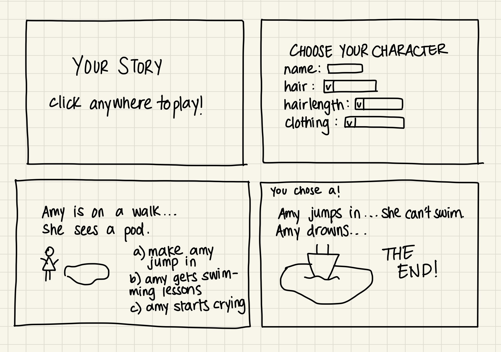

# Your Story -- Name not concrete as of yet!

## Overview

I love digital art and also writing a lot, and I want to combine both of that and make an interactive story, where users can pick and choose between options presented and determine their character's future path! 

Your Story is a website where users can visit to 'play' an interactive, choose your own adventure game. The user will first choose what there character will look like, and the name of their character, then be able to play the game. The story will have 5-6 scenes, and each scene will have 3 or more possible paths to choose from. The user may also choose to go back and change their decision.


## Data Model

The application will store choices and character features in a database
* each scene will store 3 or more choices of paths the user can take
* there will be a minimum of 5-6 scenes 
*the user's choice of character will be added to the database and used


(__TODO__: sample documents)

An Example of user input for choosing character:

```javascript
{
  characterName: "Amy",
  characterHair: "Black",
  characterHairLength: "Short",
  characterClothing: "Dress"
}

```

An example of a completed story:

```javascript
{
  characterName: "Amy",
  characterHair: "Black",
  characterHairLength: "Short",
  characterClothing: "Dress"
  scenes: [
    {
      scene1: "Amy goes on a walk and sees a pool",
      scene2: "Amy jumps into the pool",
      scene3: "Amy dies"
    }
  ]

  
}
```


## [Link to Commented First Draft Schema](db.mjs) 


(__TODO__: create a first draft of your Schemas in db.mjs and link to it)

## Wireframes

Wirefframes include a welcome page, the page for the user to select their character features, and 2 pages for example scenes. 




## Site map

welcome page --> choose character feature page --> scene 1 --> scene 2 --> etc..


## User Stories or Use Cases

1. as a user, I can choose what my character will look like
2. as a user, I can choose between options for what the story outcome will be
3. as a user, I can restart the game
4. as a user, I can save my progress and come back to it


## Research Topics

(__TODO__: the research topics that you're planning on working on along with their point values... and the total points of research topics listed)


* (2 points) Database manipulation
    * figure out how to integrate the user's input into an existing database
    * for example --> character's name will be inputted by user and stored in a database (Character) and will be used in the story, how do I make sure that particular name can be used in another database (Scene1)? 
* (3 points) Javascript/CSS animation
    * I want to figure out how to use javascript/css animation to make different effects to make it more visually interactive 
    * for example --> make the character follow a specific path (diagonal or curvy) across the screen and etc. 
* (3 points) Sessions
    * I want to figure out how to use sessions/cookies to save progress even when a user quits out of the game
    * give user the option to save their progress and return to it
* (3 points) Unit testing with javascript
    * Not sure yet which one I'll be using, but I'm leaning towards Jasmine
* (2 points) Integrate ESLint 

## [Link to Initial Main Project File](app.mjs) 


## Annotations / References Used


